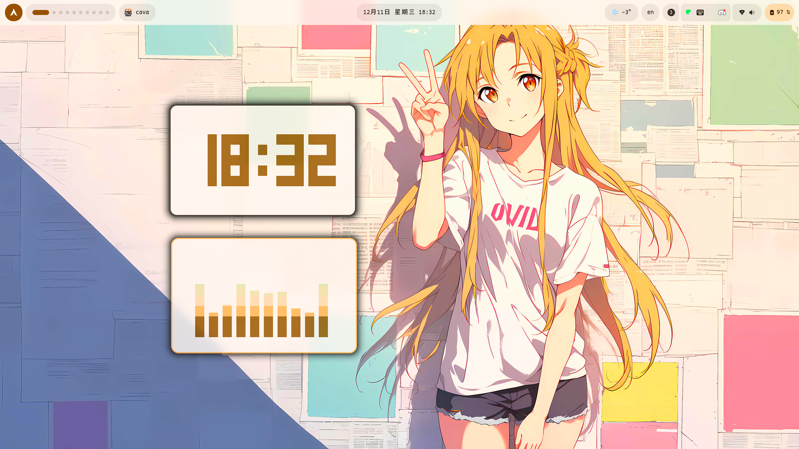
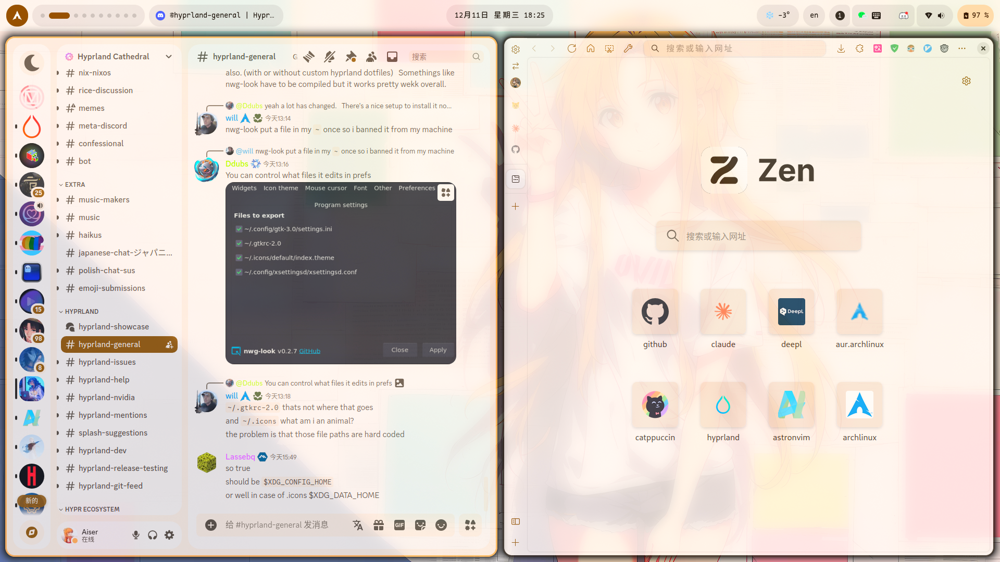
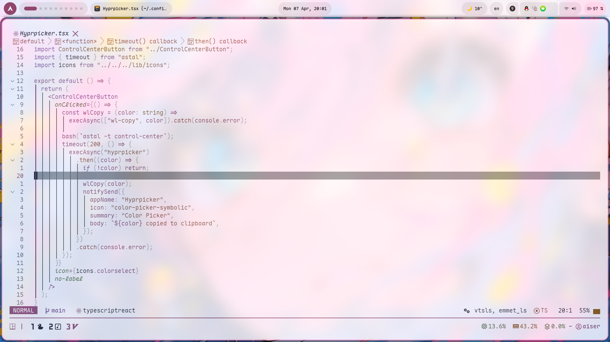
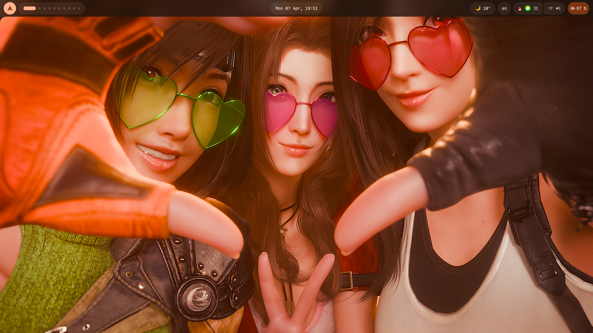
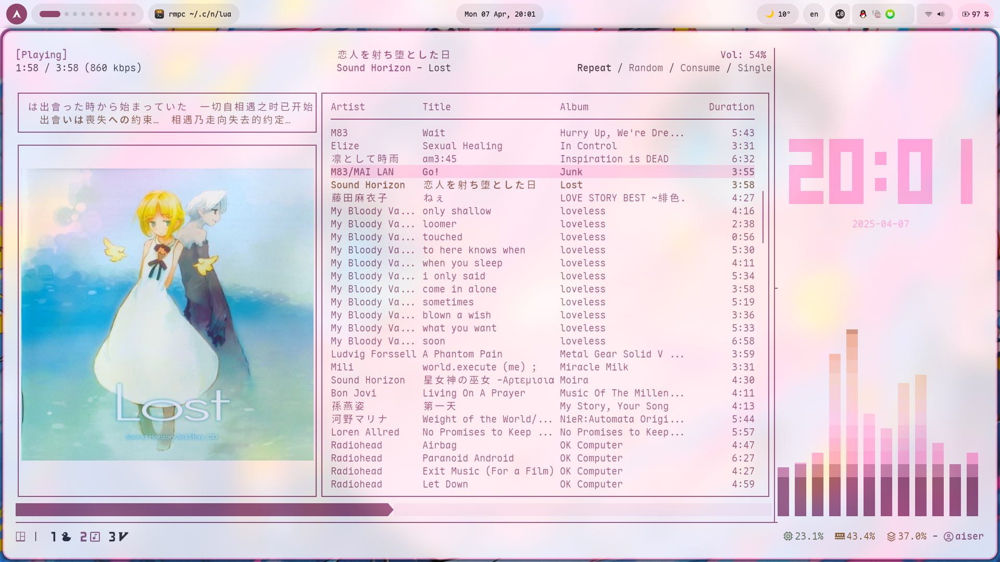

# Dotfiles-arch

## Previews

<details>
  <summary>Home</summary>
  
</details>
<details>
  <summary>General Software</summary>
  
  
</details>
<details>
  <summary>Dark Mode</summary>
  
</details>
<details>
  <summary>Dark Mode General Software</summary>
  
</details>

## Dependencies

- sassc
- swww
- maple-nerd-fonts
- pipewire
- brightnessctl
- aylurs-gtk-shell
- bun
- matugen
- kitty
- qt6ct/qt5ct
- starship
- fish
- clipse
- zen-browser
- zenity

## Install

My dotfiles is not recommended for full use, it's not perfect and easily changed by me, modular use is best.
I'll break down the entire dotfiles into major modules and provide installation instructions for each.

### Matugen

The most important module, which is responsible for implementing the generation of colours.

1. Copy the `.config/matugen` folder of my project
2. Check the `config.toml` file, for each colour you need to provide `input_path` (template location), `output_path` (location of the output theme)
3. Check the `templates` file, it contains all the templates I use.
4. After configuring `config.toml`, use `matugen image ‘wallpaper location’ -m ‘light/dark’` to generate the colours.
5. Configuration is required for `gtk` and `qt` to take effect, see the [matugen-themes](https://github.com/InioX/matugen-themes)

> [!IMPORTANT]
> For more information on using matugen, see [matugen-wiki](https://github.com/InioX/matugen/wiki)

### Aylurs-gtk-shell

1. Make sure you have installed `ags`, which is responsible for `bar`, `app-launcher` and so on.
2. If you want to use the PoSayDone's `ags` Configuration

```bash
git clone https://github.com/PoSayDone/.dotfiles_nix.git
cd .dotfiles_nix/home-manager/modules/
cp -r ags ~/.config/
```

3. There are some bugs in this configuration, e.g. `active-app` and `app-launcher` don't update in real time, I've fixed some issues as well as added some features (and removed some features.) based on PoSayDone's configuration,if you don't mind you can just use my modified config file.Please click star for PoSayDone!

### Waypaper

1. waypaper makes grips used to change the wallpaper and as a tool for `matugen` front end. You can choose your own.
2. I use `zenity` to generate the selection UI for `matugen`, if you need to change it go to `.config/waypaper/` and change `post_command` in `config.ini`.

### Other modules

For the other modules, just make sure of the paths and it's very simple to get them working.
